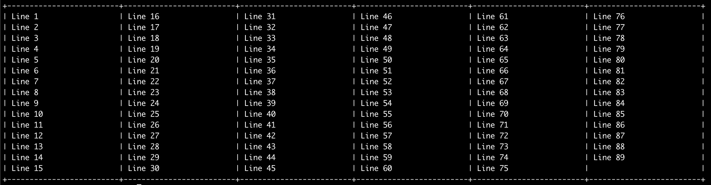

# Description
TABLER is an command line interface app. It converts lines of text from an input file into a table on the terminal.

# Usage
- make `bin/main-script.sh` file executable by `chmod +x bin/main-script.sh`.
- run the run with a text file as an argument(`./bin/main-script.sh input.txt`)

# Testing
## Sample input
```
Line 1
Line 2
Line 3
...
Line 88
Line 89
Line 90
```

## Sample Output


# Folder Structure

# Contributing
If you wish to contribute to this project, please fork the repository and submit a pull request. For major changes, please open an issue first to discuss what you would like to change.

# Contact
For any inquiries or issues, please [contact us](mailto:dropress1@gmail.com)